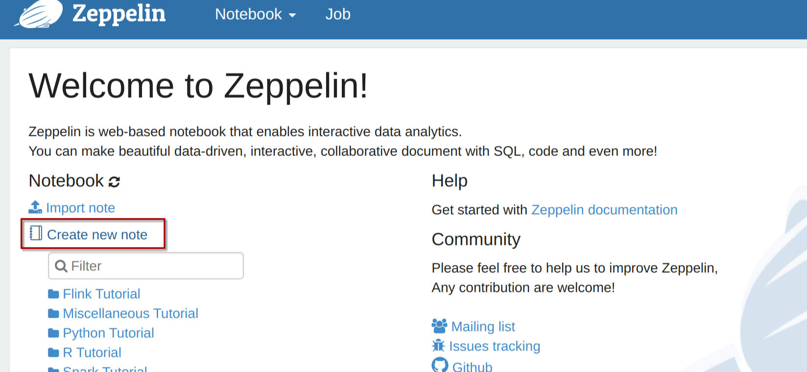
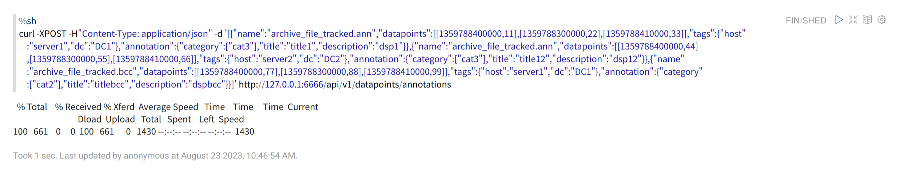

# IGinX Zeppelin User Manual

[TOC]

## Compiling IGinX Zeppelin Interpreter

Navigate to the IGinX directory and execute the following command to build the IGinX Zeppelin Interpreter:

```Shell
mvn clean package -DskipTests -P get-jar-with-dependencies
```

Upon successful compilation, you will find the `zeppelin-iginx-0.7.0-jar-with-dependencies.jar` package in the `IGinX/zeppelin-interpreter/target/` directory. We will need this package for the next steps of deploying Zeppelin.

## Deploying Zeppelin

### Direct Download

#### Downloading Zeppelin Package

Visit the Zeppelin official website at https://zeppelin.apache.org/download.html and download the package marked with a red box:

The main difference between these two packages is that the `all` package comes with all of Zeppelin's interpreters, while the `netinst` package includes only a few interpreters. Since you are using IGinX's custom interpreter, you should download the `netinst` package.

After downloading and extracting, you'll have a folder named `zeppelin-0.10.1-bin-netinst`. Go into this folder.

#### Modifying Zeppelin Settings (Optional)

##### Modifying Zeppelin Port

By default, Zeppelin uses port `8080`. If port `8080` is already in use, you can modify the Zeppelin port as follows:

In the `zeppelin-0.10.1-bin-netinst/conf/` folder, locate the file `zeppelin-site.xml.template`, make a copy and rename it to `zeppelin-site.xml`.

Edit the file and find the following code section. Change `8080` to your desired port:

```Shell
<property>
  <name>zeppelin.server.port</name>
  <value>8080</value>
  <description>Server port.</description>
</property>
```

##### Setting JAVA Path

If Zeppelin cannot find the JAVA path, you can set it by following these steps:

In the `zeppelin-0.10.1-bin-netinst/conf/` folder, locate the file `zeppelin-env.sh.template`, make a copy and rename it to `zeppelin-env.sh`.

Edit the file and find the following code section. Replace the empty value after `export JAVA_HOME=` with the path to JAVA on your machine.

```Shell
export JAVA_HOME=
```

#### Integrating IGinX Zeppelin Interpreter

In the `zeppelin-0.10.1-bin-netinst/interpreter/` folder, create a new folder named `IGinX`. Place the compiled `zeppelin-iginx-0.7.0-jar-with-dependencies.jar` package inside this folder.

#### Starting IGinX

Before starting Zeppelin, you need to start IGinX.

#### Starting Zeppelin

Finally, use the command line in the `zeppelin-0.10.1-bin-netinst/bin/` directory to run the command:

```Shell
// Unix
./zeppelin-daemon.sh start

// Windows
./zeppelin.cmd
```

This will start Zeppelin.

### Deploying via Docker

#### Starting IGinX

Before deploying Zeppelin, start IGinX.

#### Integrating IGinX Zeppelin Interpreter

Prepare a folder to place the IGinX Zeppelin Interpreter. For example, let's name the folder `zeppelin-interpreter` with the absolute path `~/code/zeppelin-interpreter/`.

Place the `zeppelin-iginx-0.7.0-jar-with-dependencies.jar` package inside this prepared `zeppelin-interpreter` folder.

#### Starting Docker Container Using Commands

Deploy Zeppelin using the following command:

```Shell
docker run -v ~/code/zeppelin-interpreter/:/opt/zeppelin/interpreter/iginx --privileged=true --name zeppelin --network host apache/zeppelin:0.10.1
```

The `-v` parameter maps a folder on the host machine to the `zeppelin` container. This folder will hold the IGinX Zeppelin Interpreter. Replace the red part with the absolute path to the folder you prepared earlier.

The `--network host` parameter avoids port mapping since Zeppelin needs to connect to the host's IGinX port directly. It uses the local port `8080`.

## Using Zeppelin

Access Zeppelin by opening your browser and visiting http://127.0.0.1:8080/. The port number should match your configuration.

### Creating a New IGinX Notebook

Click on "Create new note" within the red box.



Set a note name and choose the `iginx` interpreter under Default Interpreter.


Click "Create" to create the notebook.

### Restarting the Interpreter

The IGinX Zeppelin interpreter requires a connection to IGinX. If you restart IGinX, the interpreter will lose the connection, and you'll need to restart it.

In the notebook interface, click on the settings button within the red box. In the pop-up, click the refresh button next to the `iginx` interpreter to restart it.


### Using IGinX Statements

You can directly input IGinX statements in the notebook.


### Using RESTful Statements

RESTful curl statements are shell commands. To use them, you need the Zeppelin built-in shell interpreter.

Start the statement with `%sh` on the first line, then input the remaining commands on the second line. Additionally, since Zeppelin doesn't support passing files, include the JSON part of the curl command directly in the statement.


