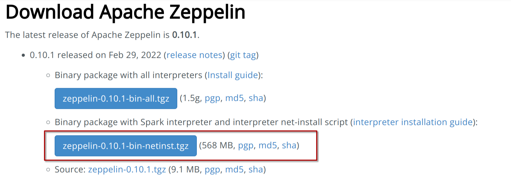
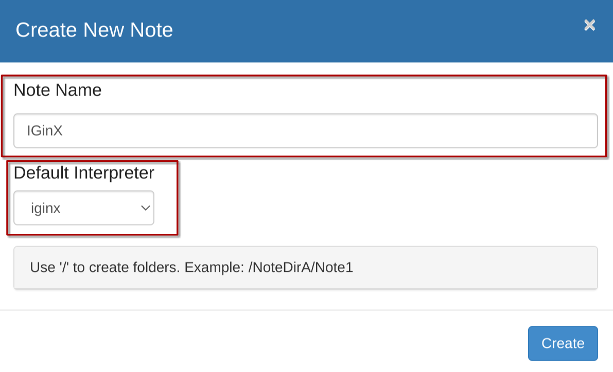
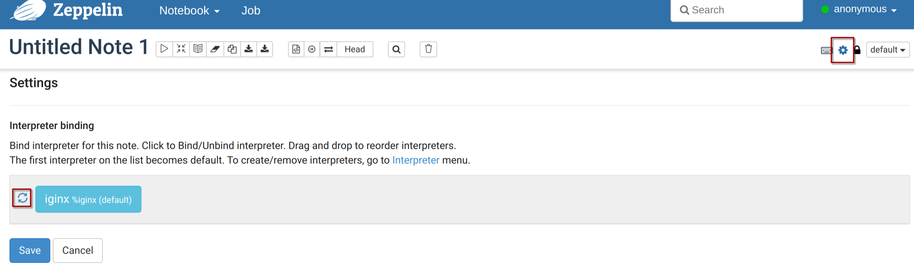
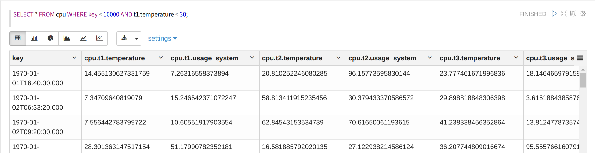

# IGinX Zeppelin使用手册

[TOC]

## 编译IGinX Zeppelin Interpreter

进入IGinX目录，执行下面的语句以构建IGinX Zeppelin Interpreter

```Shell
mvn clean package -DskipTests -P get-jar-with-dependencies    
```

构建成功后，在`IGinX/zeppelin-interpreter/target/`路径下找到`zeppelin-iginx-0.7.1-jar-with-dependencies.jar`包。

在下一步部署Zeppelin时我们需要用到这个包。

## 部署Zeppelin

### 直接下载

#### 下载Zeppelin包

前往Zeppelin官网https://zeppelin.apache.org/download.html，下载红框标记出的包：

这两个包的区别是`all`包自带了zeppelin所有的解释器，而`netinst`只带有少量解释器，因为我们使用IGinX自行实现的解释器，因此下载`netinst`版本即可。



下载解压后，能够得到`zeppelin-0.10.1-bin-netinst`文件夹，进入其中。

#### 修改Zeppelin设置（可选）

##### 修改Zeppelin端口

Zeppelin默认占用`8080`端口，如果8080端口已被占用，可以按照以下步骤修改Zeppelin端口。

在`zeppelin-0.10.1-bin-netinst/conf/`文件夹下找到文件`zeppelin-site.xml.template`，复制一份并改名为`zeppelin-site.xml`。

编辑文件，在文件中找到下面这段代码，将`8080`修改为自己想要的端口即可。

```Shell
<property>
  <name>zeppelin.server.port</name>
  <value>8080</value>
  <description>Server port.</description>
</property>
```

##### 设置JAVA路径

如果Zeppelin找不到JAVA路径，可以尝试通过以下步骤设置JAVA路径。

在`zeppelin-0.10.1-bin-netinst/conf/`文件夹下找到文件`zeppelin-env.sh.template`，复制一份并改名为`zeppelin-env.sh`。

编辑文件，在文件中找到下面这段代码，在`=`后填入本机的JAVA路径即可。

```Shell
export JAVA_HOME=
```

#### 接入IGinX Zeppelin Interpreter

在`zeppelin-0.10.1-bin-netinst/interpreter/`文件夹下新建一个文件夹`IGinX`，将构建好的`zeppelin-iginx-0.7.1-jar-with-dependencies.jar`包放入其中即可。

#### 启动IGinX

接下来在启动Zeppelin前，我们需要先启动IGinX。

#### 启动Zeppelin

最后，用命令行在`zeppelin-0.10.1-bin-netinst/bin/`中目录下，运行命令：

```Shell
// Unix
./zeppelin-daemon.sh start

// Windows
./zeppelin.cmd
```

即可启动Zeppelin。

### 通过Docker部署

#### 启动IGinX

在部署Zeppelin之前，先启动IGinX。

#### 接入IGinX Zeppelin Interpreter

我们需要准备一个文件夹，用于放置IGinX Zeppelin Interpreter。例如我们准备一个文件夹名为`zeppelin-interpreter`，其绝对路径为`~/code/zeppelin-interpreter/`。

将`zeppelin-iginx-0.7.1-jar-with-dependencies.jar`包放入我们准备好的`zeppelin-interpreter`文件夹内即可。

#### 使用命令启动Docker容器

通过以下代码部署Zeppelin

```Shell
docker run -v ~/code/zeppelin-interpreter/:/opt/zeppelin/interpreter/iginx --privileged=true --name zeppelin --network host apache/zeppelin:0.10.1
```

`-v` 参数是将宿主机的一个文件夹映射到zeppelin容器内，用于放置IGinX Zeppelin Interpreter，在上一步我们已经准备好了这个文件夹。将文件夹绝对路径替换掉红色部分即可。

`--network host` 参数是不使用端口映射，因为zeppelin还需要连接宿主机的IGinX端口，因此直接使用本地端口`8080`。

## 使用Zeppelin

使用浏览器访问http://127.0.0.1:8080/，即可进入Zeppelin。端口号根据自己的设置修改。

### 新建IGinX笔记本

点击红框内的Create new note


设置note name，并在Default Interpreter中找到iginx



点击create即可创建笔记本。

### 重启解释器

IGinX Zeppelin解释器是需要连接IGinX的，如果我们重启了IGinX，解释器就会断开连接，此时我们需要重启解释器。

在笔记本界面，我们点击红框内的设置按钮。再在出现的页面中，点击iginx解释器左边的刷新按钮，即可重启解释器。



### 使用IGinX语句

直接在笔记本中输入IGinX语句即可。



### 使用RESTful语句

RESTful的curl语句属于shell语句，我们需要用到Zeppelin自带的shell解释器。

使用shell解释器的方法是在第一行增加`%sh`，剩余语句在第二行输入。另外由于Zeppelin不支持传入文件，curl中的json部分需要直接写在语句里。


